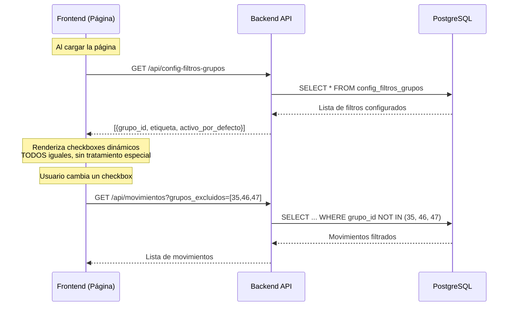

# Documentación: Filtros "Excluir" en Conciliación Bancaria

## 📌 Resumen

Los filtros "Excluir" permiten al usuario ocultar movimientos de ciertos **grupos** de la visualización y reportes. Esta funcionalidad es **dinámica** y configurable desde la base de datos.

> [!IMPORTANT]
> Todos los filtros de exclusión deben ser dinámicos, sin IDs hardcodeados en el código.
> El filtro "Excluir Traslados" NO tiene tratamiento especial, es igual a "Excluir Tita" y "Excluir Préstamos".

---

## 🗄️ Tabla de Configuración: `config_filtros_grupos`

### Estructura

| Campo | Tipo | Descripción |
|-------|------|-------------|
| `id` | SERIAL | Identificador único (PK) |
| `grupo_id` | INTEGER | FK a `grupos.grupoid` - El grupo a excluir |
| `etiqueta` | VARCHAR(100) | Texto del checkbox en UI (ej: "Excluir Préstamos") |
| `activo_por_defecto` | BOOLEAN | Si el checkbox inicia **marcado** al cargar la página |

### Datos Actuales

| id | grupo_id | etiqueta | activo_por_defecto |
|----|----------|----------|-------------------|
| 1 | 35 | Excluir Préstamos | ✅ Sí |
| 2 | 46 | Excluir Tita | ✅ Sí |
| 3 | 47 | Excluir Traslados | ✅ Sí |

> [!NOTE]
> **Todos los filtros de exclusión son activos por defecto.**
> La única excepción es el checkbox "Por Clasificar" (que muestra solo pendientes) que inicia desactivado.

---

## 🔄 Flujo de Funcionamiento (Diseño Esperado)



### Comportamiento Correcto

1. Frontend carga la configuración de `config_filtros_grupos`
2. Renderiza **un checkbox por cada registro** con la etiqueta correspondiente
3. Todos inician **marcados** si `activo_por_defecto = true`
4. Al cambiar cualquier checkbox, se envía el array `grupos_excluidos` al backend
5. Backend excluye movimientos donde `grupo_id IN (grupos_excluidos)`

---

## 🖥️ Páginas que Usan los Filtros

| Página | Archivo | Estado |
|--------|---------|--------|
| Gestión de Movimientos | [MovimientosPage.tsx](file:///f:/1.%20Cloud/4.%20AI/1.%20Antigravity/Conciliación%20Bancaria/ConciliaciónBancariaWeb/frontend/src/pages/MovimientosPage.tsx) | ⚠️ Ver problemas |
| Clasificaciones | [ReporteClasificacionesPage.tsx](file:///f:/1.%20Cloud/4.%20AI/1.%20Antigravity/Conciliación%20Bancaria/ConciliaciónBancariaWeb/frontend/src/pages/ReporteClasificacionesPage.tsx) | ⚠️ Ver problemas |
| Egresos por Tercero | [ReporteEgresosTerceroPage.tsx](file:///f:/1.%20Cloud/4.%20AI/1.%20Antigravity/Conciliación%20Bancaria/ConciliaciónBancariaWeb/frontend/src/pages/ReporteEgresosTerceroPage.tsx) | ⚠️ Ver problemas |
| Egresos por Grupo | [ReporteEgresosGrupoPage.tsx](file:///f:/1.%20Cloud/4.%20AI/1.%20Antigravity/Conciliación%20Bancaria/ConciliaciónBancariaWeb/frontend/src/pages/ReporteEgresosGrupoPage.tsx) | ⚠️ Ver problemas |
| Ingresos y Gastos | [ReporteIngresosGastosMesPage.tsx](file:///f:/1.%20Cloud/4.%20AI/1.%20Antigravity/Conciliación%20Bancaria/ConciliaciónBancariaWeb/frontend/src/pages/ReporteIngresosGastosMesPage.tsx) | ⚠️ Ver problemas |
| Descargar Movimientos | [DescargarMovimientosPage.tsx](file:///f:/1.%20Cloud/4.%20AI/1.%20Antigravity/Conciliación%20Bancaria/ConciliaciónBancariaWeb/frontend/src/pages/DescargarMovimientosPage.tsx) | ⚠️ Ver problemas |

---

## ⚠️ Problemas Actuales Detectados

### 1. Tratamiento Especial de Traslados en Frontend

El checkbox "Excluir Traslados" tiene implementación **separada** del resto:

```typescript
// Variables específicas para Traslados (INCORRECTO)
const [excluirTraslados, setExcluirTraslados] = useSessionStorage('filtro_excluirTraslados', true)

// Props específicas (INCORRECTO)
showExcluirTraslados={true}
onExcluirTrasladosChange={setExcluirTraslados}
```

En `FilterToggles.tsx` línea 77, hay lógica que EXCLUYE Traslados de los dinámicos:
```typescript
.filter(config => !(showExcluirTraslados && config.etiqueta.toLowerCase().includes('traslado')))
```

**Esto está MAL.** Traslados debería manejarse igual que Tita y Préstamos.

### 2. IDs Hardcodeados en Scripts

Los siguientes archivos contienen IDs hardcodeados (35, 46, 47):

| Archivo | Línea | Contenido |
|---------|-------|-----------|
| [create_table_filters.py](file:///f:/1.%20Cloud/4.%20AI/1.%20Antigravity/Conciliación%20Bancaria/ConciliaciónBancariaWeb/Backend/create_table_filters.py) | 28-30 | `(35, 'Excluir Préstamos', True),`... |
| [check_groups_custom.py](file:///f:/1.%20Cloud/4.%20AI/1.%20Antigravity/Conciliación%20Bancaria/ConciliaciónBancariaWeb/Backend/check_groups_custom.py) | 18 | `WHERE grupoid IN (35, 46, 47)` |
| [check_counts.py](file:///f:/1.%20Cloud/4.%20AI/1.%20Antigravity/Conciliación%20Bancaria/ConciliaciónBancariaWeb/Backend/check_counts.py) | 12 | `AND GrupoID IN (35, 46, 47)` |
| [check_concepts_custom.py](file:///f:/1.%20Cloud/4.%20AI/1.%20Antigravity/Conciliación%20Bancaria/ConciliaciónBancariaWeb/Backend/check_concepts_custom.py) | 19 | `WHERE grupoid_fk IN (35, 46)` |
| [check_movimiento_nulls.py](file:///f:/1.%20Cloud/4.%20AI/1.%20Antigravity/Conciliación%20Bancaria/ConciliaciónBancariaWeb/Backend/check_movimiento_nulls.py) | 27 | `WHERE GrupoID = 46` |

> [!CAUTION]
> Estos archivos son scripts de utilidad/debug, pero igualmente no deberían tener IDs hardcodeados.

### 3. Backend tiene parámetro separado `excluir_traslados`

En la API hay un parámetro específico:
```python
# movimientos.py - INCORRECTO
excluir_traslados: bool = False,
```

Esto debería manejarse a través de `grupos_excluidos` como los demás.

---

## ✅ Cómo DEBERÍA Funcionar (Corrección Propuesta)

### Frontend

1. **Eliminar** las variables y props específicas de Traslados:
   - `excluirTraslados`, `setExcluirTraslados`
   - `showExcluirTraslados`, `onExcluirTrasladosChange`

2. **Todos los filtros manejarlos con:**
   - `configuracionExclusion` - configuración desde BD
   - `gruposExcluidos` - IDs actualmente excluidos
   - `onGruposExcluidosChange` - callback

3. **En FilterToggles.tsx:** Eliminar la lógica que filtra Traslados

### Backend

1. **Eliminar** el parámetro `excluir_traslados` de los endpoints
2. **Usar solo** `grupos_excluidos` para todas las exclusiones

### Scripts de Utilidad

1. Los scripts `check_*.py` deben consultar dinámicamente los IDs desde `config_filtros_grupos`

---

## ➕ Cómo Agregar un Nuevo Filtro de Exclusión

1. **En la base de datos:**
   ```sql
   INSERT INTO config_filtros_grupos (grupo_id, etiqueta, activo_por_defecto)
   VALUES (99, 'Excluir Inversiones', true);
   ```

2. **El frontend lo detectará automáticamente** al recargar la página.

3. No se requieren cambios de código si el nuevo grupo ya existe en la tabla `grupos`.

---

## 📊 Arquitectura de Filtrado

### ¿Por qué se filtra en el Backend?

| Razón | Explicación |
|-------|-------------|
| **Volumen de datos** | Miles de movimientos serían muy pesados para el navegador |
| **Cálculo de totales** | Los agregados (Ingresos, Egresos, Saldo) se calculan con SQL |
| **Rendimiento de red** | Solo viajan los datos necesarios |
| **Consistencia** | El mismo filtro aplica para reportes y exportaciones |

**Decisión: Continuar filtrando en el backend.**
